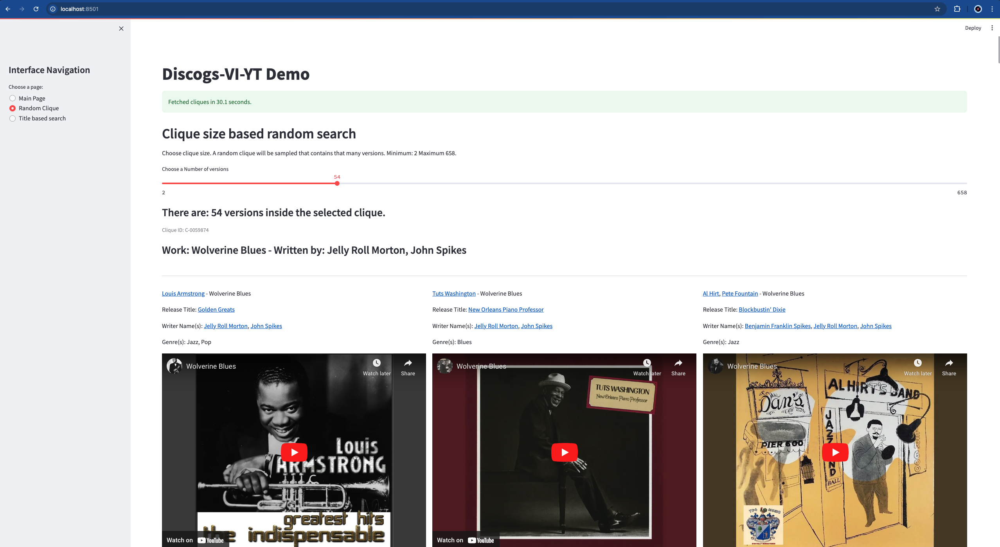

# Discogs-VI Dataset

TODO doi zenodo
<!-- [](https://doi.org/10.5281/zenodo.3826813) -->

Discogs-VI is a Version Identification (VI), also known as Cover Song Identification (CSI) dataset, created using editorial metadata from the [Discogs](https://discogs.com) database. The version relationship between millions of tracks were determined through rules based on writer artist, performer artist, and track title metadata. A large portion of these versions were mapped to official YouTube IDs to create its Discogs-VI-YT subset. The dataset is used for research by [Music Technology Group](https://www.upf.edu/web/mtg). This webpage contains summary information regarding the dataset and provides instructions on how to access and use it and the repository contains the code to re-create boths datasets and to download audio from the matched YouTube videos.

Discogs regularly releases public data dumps containing comprehensive release metadata (such as artists, genres, styles, labels, release year, and country). See an [example](https://www.discogs.com/Prodigy-Firestarter/release/3804513) of a release page. See how the Discogs database is built [here](https://support.discogs.com/hc/en-us/articles/360008545114-Overview-Of-How-DiscogsIs-Built). You can see some statistics for all music releases submitted to Discogs on their [explore page](https://www.discogs.com/search/).

In the VI literature the set of tracks that are versions of each other is defined as a *clique*. Here’s an example of the metadata for a [clique](./data/example_clique.json). Discogs-VI contains about 1.9 million versions belonging to around 348,000 cliques, while Discogs-VI-YT includes 493,000 versions across 98,000 cliques.

## Table of contents

* [Dependencies](#dependencies)
* [Download](#download)
  * [Metadata](#metadata)
  * [Audio](#audio)
  * [Audio repesentations](#audio-representations)
* [Data Structure](#data-structure)
  * [Main files](#main-files)
  * [Intermediary files](#intermediary-files)
  * [Loading with python](#loading-with-python)
* [Streamlit demo](#discogs-vi-yt-streamlit-demo)
* [Re-create the dataset](#re-create-the-dataset)
* [Cite](#cite)
* [License](#license)

## Dependencies

We use Python 3.10.9 on Linux.

```bash
git clone https://github.com/MTG/discogs-vi-dataset
cd discogs-vi-dataset
conda env create -f environment.yaml
conda activate discogs-vi-dataset
```

## Download

Three types of data are associated with the dataset: clique metadata (Discogs-VI), clique metadata with YouTube ID-matched versions (Discogs-VI-YT), and audio representations such as CQT (Constant-Q Transform) extracted for the versions of Discogs-VI. This section provides details on how to access each type of data.

### Metadata

TODO zip the files, describe the contents in a readme file inside the main directory. add a license.
TODO upload to zenodo, add the url here.

We provide all the metadata including the intermediary files of the dataset creation process and the final outputs. Due to their sizes they are separated into two directories so that one does not have to download everything. If your goal is to download the main metadata and start working, download `discogs_20240701/main/` (21GB before compressing). If for some reason you are interested in the intermediary files, you download `discogs_20240701/intermediary/` (46GB before compressing). Contents of these folders are provided in [this section](#data-structure).

### Audio

You can download the audio files corresponding to the official YouTube IDs of the versions. In our experiments, we used exactly these IDs.

```bash
python discogs_vi_yt/audio_download_yt/download_missing_version_youtube_urls.py Discogs-VI-YT-20240701.jsonl music_dir/
```

However, `Discogs-VI-20240701.jsonl.youtube_query_matched` contains more versions with YouTube IDs (Read the paper for understanding why or check this [section](#main-files)).

```bash
python discogs_vi_yt/audio_download_yt/download_missing_version_youtube_urls.py Discogs-VI-20240701.jsonl.youtube_query_matched music_dir/
```

**NOTE**: We recommend parallelizing this operation because there are many audio files using `utilities/shuffle_and_split.sh`. However, if you use too many parallel processes you may get banned from YouTube. We experimented with 2-20 processes. After 10 processes we got banned a few times. In that case, you should stop downloading and wait a couple of days before trying again.

```bash
utilities/shuffle_and_split.sh Discogs-VI-YT-20240701.jsonl 16
```

Then open up multiple terminal instances and call each split separately.

```bash
python discogs_vi_yt/audio_download_yt/download_missing_version_youtube_urls.py Discogs-VI-20240701.jsonl.youtube_query_matched.split.00 music_dir/
```

### Audio representations

This repository does not contain the code for extracting the CQT audio representations used to train the `Discogs-VINet` described in the paper, nor the features themselves. The model and code to extract the features are available in a separate [repository](https://github.com/raraz15/Discogs-VINet). The features that we extracted are available upon request **strictly** for research purposes. You can contact us for making a request.

Contact: R. Oğuz Araz <recepoguz.araz@upf.edu>

## Data Structure

Below you can find some information about the contents of the dataset and how to load them using Python.

### Main files

* `Discogs-VI-20240701.jsonl` corresponds to Discogs-VI dataset which contains the cliques and their metadata. The versions are not mapped to Youtube URLs.
* `Discogs-VI-YT-20240701.jsonl` corresponds to Discogs-VI-YT dataset where individual versions of Discogs-VI are mapped to Youtube URLs and postprocessed so that each clique has at least two downloaded versions.
* However we could match much more videos than we could download in Barcelona between 2023-2024. Maybe depending on your location you can download more. `Discogs-VI-20240701.jsonl.youtube_query_matched` contains all these videos.
  * Some versions are matched to more than one alternative YouTube ID (1.4 video per version on average) and the matches are sorted from the highest quality match to the lowest, although all matches are official matches.
* `Discogs-VI-20240701.jsonl` and `Discogs-VI-YT-20240701.jsonl` contain rich metadata, therefore these files are large in size (around 7 GB and 4 GB). Therefore we provide a file where only clique, version, and Youtube IDs are provided: `Discogs-VI-YT-light-20240701.json`
* We then create train, validation, and test partitions from `Discogs-VI-YT-light-20240701.jsonl` after dealing with Da-TACOS and SHS100K datasets (see the paper for more information).
* `discogs_20240701_artists.xml.jsonl.clean` contains detailed artist related information.
* `Discogs-VI-YT-20240701.jsonl.demo` should be used with the streamlit demo for visualization purposes.

**NOTE**: Every clique and version has a unique ID associated to them. Currently the clique IDs change between Discogs dumps. I intend to fix this later.

### Intermediary files

* `discogs_20240701_artists.xml.jsonl` is the Discogs artist data dump xml file parsed to a json file with some processing. It contains artist information such as aliases, group memberships, or name variations.
* `discogs_20240701_releases.xml.jsonl` is the parsed releases file.
* `discogs_20240701_releases.xml.jsonl.clean` is the cleaned version.
* `discogs_20240701_releases.xml.jsonl.clean.tracks` parses the releases to tracks.
* `Discogs-VI-20240701-DaTACOS-SHS100K2_TEST-lost_cliques.txt` contains the clique ids in Discogs-VI that intersect with Da-TACOS and SHS100K datasets.
* `Discogs-VI-20240701.jsonl.queries` contains the query strings that was created to search the versions on YouTube.

### Loading with python

The files have different encodings and structure. Here you can find how to load each file.

#### `Discogs-VI-20240701.jsonl`, `Discogs-VI-20240701.jsonl.youtube_query_matched`, and `Discogs-VI-YT-20240701.jsonl`

```python
# Read the file with utf-8 encoding
with open("Discogs-VI-YT-20240701.jsonl", encoding="utf-8") as in_f:
    # Read the file one line at a time
    for jsonline in in_f:
        # Load the clique
        clique = json.loads(jsonline)
        # Access the versions
        for version in clique["versions"]:
            # Access the urls or other metadata. For Discogs-VI-20240701.jsonl there are no youtube_video field
            for video in version["youtube_video"]:
                pass
```

#### `Discogs-VI-YT-20240701-light.json`, `Discogs-VI-YT-20240701-light.json.train`, `Discogs-VI-YT-20240701-light.json.val`, and `Discogs-VI-YT-20240701-light.json.test`

```python
# Read the file with default encoding
with open("Discogs-VI-YT-light-20240701.json") as in_f:
    # Load the cliques
    cliques = json.load(in_f)
# Access the data
```

```python
with open("discogs_20240701_artists.xml.jsonl.clean", encoding="utf-8") as infile:
    for jsonline in infile:
        artist = json.loads(jsonline)
```

#### Rest of the files

* `discogs_20240701_artists.xml.jsonl`, `discogs_20240701_releases.xml.jsonl`, `discogs_20240701_releases.xml.jsonl.clean`, discogs_20240701_releases.xml.jsonl.clean.tracks are JSONL files with utf-8 encoding.
* `Discogs-VI-20240701-DaTACOS-SHS100K2_TEST-lost_cliques.txt` and `Discogs-VI-20240701.jsonl.queries` are line-delimited text files.

Please refer to the code for more examples.

## Discogs-VI-YT Streamlit demo

Run the demo with streamlit using:

```bash
streamlit run demo.py --server.fileWatcherType -- Discogs-VI-YT-20240701.jsonl.demo
```



## Re-create the dataset

The steps to re-create the dataset is detailed in a separate [README](./README-recreate.md) file. Since Discogs database is growing one can run the pipeline periodically and extend the dataset. We plan to create a new version of the dataset every year or so.

## Cite

TODO:

Please cite the following publication when using the dataset:

> Araz, R. Oguz and Serra, Xavier and Bogdanov, Dmitry

```bibtex
@conference {,
    author = "Araz, R. Oguz and Serra, Xavier and Bogdanov, Dmitry",
    title = "Discogs-VI: A Musical Version Identification Dataset Based on Public Editorial Data",
    booktitle = "",
    year = "2024",
}
```

## License

TODO

## Acknowledgements

This work is supported by “IA y Música: Cátedra en Inteligencia Artificial y Música” (TSI-100929-2023-1) funded by the Secretaría de Estado de Digitalización e Inteligencia Artificial and the European Union-Next Generation EU, under the program Cátedras ENIA.
